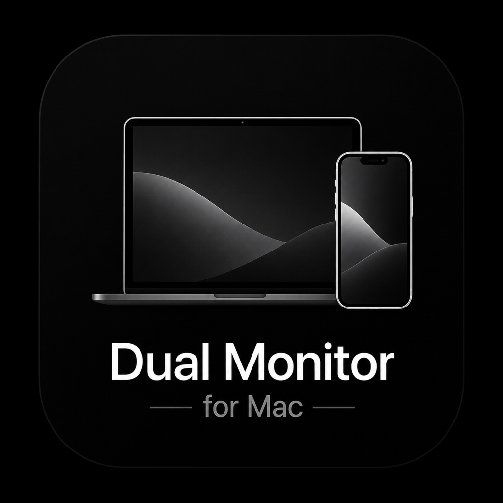

  
  
    

  <h1>Dual Monitor For Mac</h1>

  <b>The ultimate zero-lag screen mirroring experience. Turn your iPhone or iPad into a breathtaking 120 FPS, 4K secondary display for your Mac.</b>

    

  

    
    
    
  

---

 

## ✨ The Magic Behind The Speed

**Dual Monitor For Mac** isn't just another screen mirroring app. It was engineered from the ground up to bypass the latency of traditional Wi-Fi casting (like AirPlay). 

By utilizing raw **hardware video decoding (VideoToolbox)** combined with a direct **wired USB tunnel (usbmuxd)**, it achieves something extraordinary: **True Zero-Perceivable Latency**. 

> *"It feels like your iPhone screen is natively hardwired to your Mac's graphics card."*

 

## 🚀 Key Features

| Feature | Description |
| :--- | :--- |
| ⚡️ **Zero Latency USB** | Connect via a standard Lightning or USB-C cable. Bypasses spotty Wi-Fi completely for rock-solid stability. |
| 🎮 **120 FPS & 4K Ready** | Buttery smooth 120Hz refresh rates on ProMotion displays. Crystal clear resolution scaling. |
| 🔊 **Native Audio Routing** | Mac audio is forwarded perfectly in sync to your iOS device speakers. |
| 🔒 **100% Private** | All video and audio streams are localized. No internet required. No cloud servers. No data harvesting. |
| 🔋 **Battery Efficient** | Utilizes hardware H.264 video decoding to keep your device cool and save battery life. |

 

## 📥 How to Install & Connect

Because this app utilizes raw Apple system daemons (`usbmuxd`) to achieve its zero-latency USB speeds, the Mac Host app cannot be distributed on the strict Mac App Store. It is split into two halves:

### 1. The Mac Host (Server)
1. Go to the [Releases page](https://github.com/techgamewithharsh-dot/Dual_Display_For_Mac/releases).
2. Download the latest `DualMonitorForMac.dmg`.
3. Open the `.dmg` and simply drag the app into your **Applications** folder.

### 2. The iOS Client (Display)
1. Download **Dual Monitor For Mac** from the iOS App Store. *(Link coming soon)*

### 3. Start Mirroring!
- Connect your iPhone or iPad to your Mac using a USB cable.
- Open the app on your Mac (look for the icon in your top menu bar).
- Open the app on your iOS device.
- Enter the **4-digit security PIN** displayed on your Mac into your iPhone.
- **Enjoy your new ultra-fast secondary display!**

 

---

  
<b>Built with ❤️ for Apple Ecosystem Power Users</b>

  
<a href="https://techgamewithharsh-dot.github.io/Dual_Display_For_Mac/">Visit the Official Landing Page</a>

